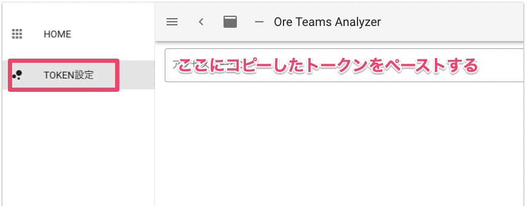
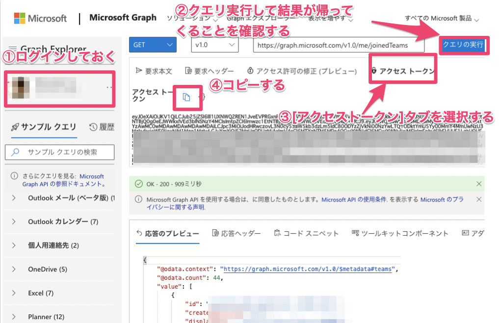

# teams-analyzer

Microfost Teamsのチームやチャネルの分析用データを取得します。
## Build Setup

```bash
# install dependencies
$ yarn install

# serve with hot reload at localhost:3000
$ yarn dev

# build for production and launch server
$ yarn build
$ yarn start

# generate static project
$ yarn generate

# リポジトリチェック
$ npx repolinter
```

For detailed explanation on how things work, check out [Nuxt.js docs](https://nuxtjs.org).

## 本プロジェクト環境を構築した際の参考サイト

https://qiita.com/k_kind/items/e2f07f70c9e4455b9902

## アクセストークンについて

Graph APIの実行にはアクセストークンが必要です。
以下のいずれかの手順で自身のアカウントのアクセストークンを取得し、[TOKEN設定]画面より登録して



### 手作業で取得する方法（推奨）

1. [Graphエクスプローラーサイト](https://developer.microsoft.com/ja-jp/graph/graph-explorer)にアクセスし、自身のアカウントでサインインし、APIを実行する
2. 画面内のアクセストークンタブを開くとアクセストークンが表示されるのでコピーする


ください。

### Chrome拡張機能を使う方法（Deprecated）

**カスタム拡張機能のインストール（初回のみ）**

1. Chromeブラウザを起動し、拡張機能を表示する
  

1. 「パッケージ化されていない拡張機能を読み込む」ボタンをクリックし、`ChromeExtension`フォルダを指定して読み込む
  

以上で拡張機能がChromeで使えるようになります。

**拡張機能の実行**

1. [Graphエクスプローラーサイト](https://developer.microsoft.com/ja-jp/graph/graph-explorer)にアクセスし、自身のアカウントでサインインし、APIを実行する
1. インストールした拡張機能のアイコンをクリックすると、アクセストークンがクリップボードにされるので、アプリの[TOKEN設定]画面でペーストする。

